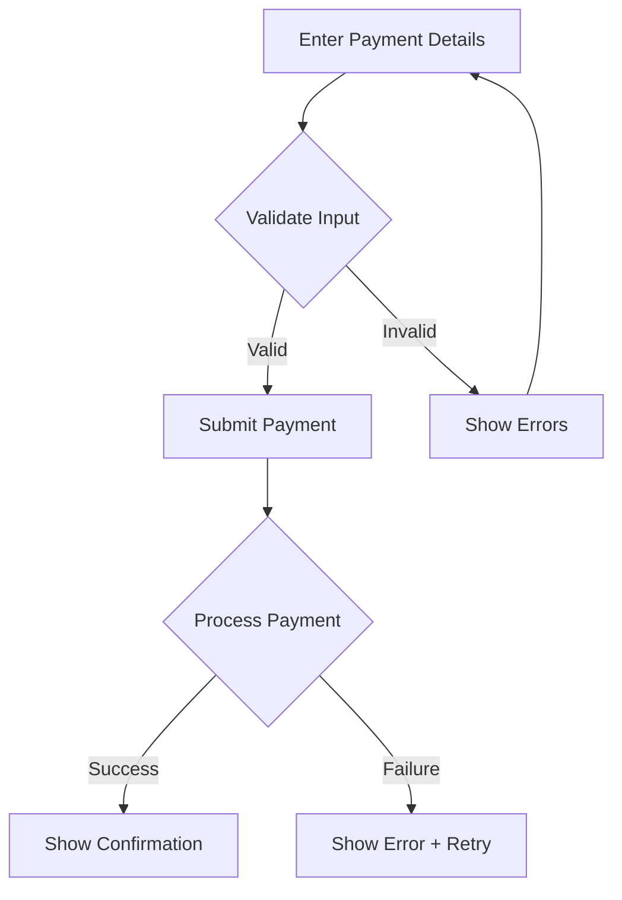
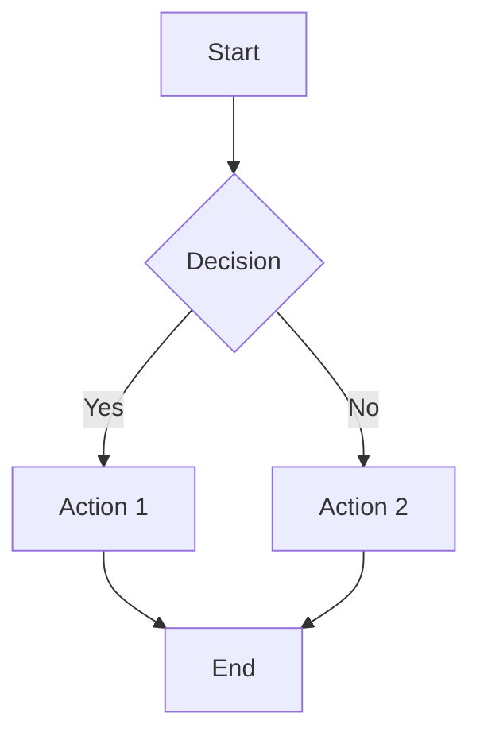
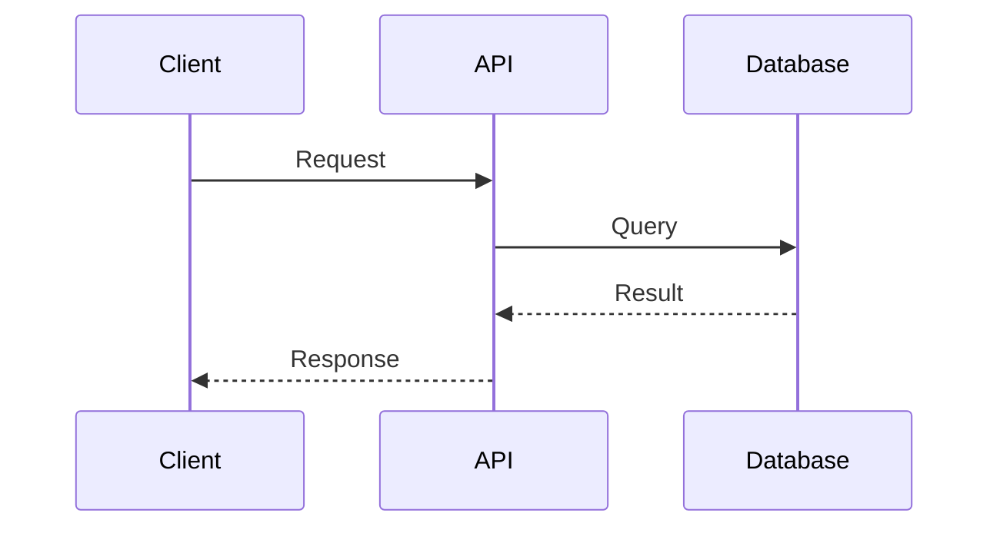
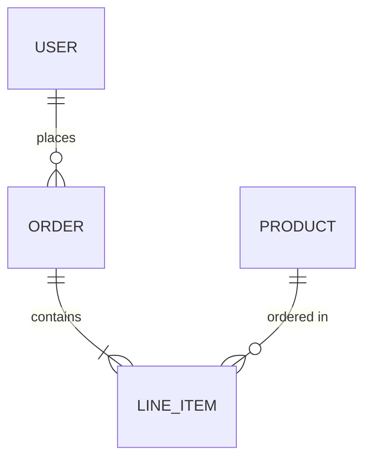

# Consolidation Patterns

> Common patterns for document consolidation across all document types.

---

## Content Consolidation Patterns

### Pattern: Scattered Content Collection

**Problem:** Information about a topic is spread across multiple sections.

**Solution:**
1. Identify all locations containing topic content
2. Determine canonical location (where reader expects it)
3. Move content to canonical location
4. Leave brief reference at original location if needed

**Example:**
```markdown
# Before
## API Section
[API endpoints...]
[Some authentication details...]

## Security Section
[More authentication details...]
[Authorization rules...]

# After
## API Section
[API endpoints...]
See: Security section for authentication

## Security Section
[Complete authentication details - consolidated]
[Authorization rules...]
```

---

### Pattern: Duplicate Elimination

**Problem:** Same information appears in multiple places.

**Solution:**
1. Identify all duplicates
2. Keep the most complete/accurate version
3. Remove others, optionally leaving reference

**Decision Matrix:**
| Keep In | Remove From | When |
|---------|-------------|------|
| More detailed location | Less detailed | Detail matters |
| Reader-expected location | Unexpected | Navigation matters |
| Earlier section | Later section | Flow matters |

---

### Pattern: Code Streamlining (Architecture Only)

**Problem:** Implementation code copied from source files.

**Solution:**
Replace with architectural description + file reference.

**Template:**
```markdown
**[ComponentName]** handles [responsibility].

| Aspect | Details |
|--------|---------|
| Trigger | [what initiates it] |
| Input | [what it receives] |
| Output | [what it produces] |
| Key Logic | [brief description of algorithm/approach] |

**Implementation:** `app/path/to/File.java`
```

**Before:**
```java
@Service
public class PaymentProcessor {
    @Autowired
    private PaymentGateway gateway;

    public PaymentResult process(Payment payment) {
        // 40 lines of implementation
    }
}
```

**After:**
```markdown
**PaymentProcessor** orchestrates payment execution.

| Aspect | Details |
|--------|---------|
| Trigger | Payment request from API |
| Input | Payment object with amount, method, customer |
| Output | PaymentResult with status, transaction ID |
| Key Logic | Validates → Routes to gateway → Records result |

**Implementation:** `app/api/src/main/java/.../PaymentProcessor.java`
```

---

### Pattern: Section Merge

**Problem:** Two sections have significant overlap or one is too small.

**Solution:**
1. Identify the primary section (larger, more expected location)
2. Move unique content from secondary to primary
3. Remove secondary section
4. Update ToC and cross-references

**Merge Checklist:**
- [ ] All unique content preserved
- [ ] No duplicate content in merged section
- [ ] Section name reflects combined content
- [ ] ToC updated
- [ ] Cross-references updated

---

### Pattern: Section Split

**Problem:** Section is too large (>500 lines) covering multiple topics.

**Solution:**
1. Identify distinct topics within section
2. Create new sections for each topic
3. Move content to appropriate new sections
4. Add cross-references between related sections

**Split Checklist:**
- [ ] Each new section is self-contained
- [ ] No content lost in split
- [ ] Logical section ordering
- [ ] ToC updated
- [ ] Cross-references added

---

## Document-Type Specific Patterns

### Architecture Document Patterns

#### Pattern: API Contract Documentation

**Keep:**
```markdown
## Payment API

### POST /api/v1/payments

**Request:**
```json
{
  "amount": 10000,
  "currency": "USD",
  "method": "card"
}
```

**Response:** `201 Created`
```json
{
  "payment_id": "pay_123",
  "status": "processing"
}
```
```

#### Pattern: Schema Documentation

**Keep:**
```sql
CREATE TABLE payments (
    id UUID PRIMARY KEY,
    amount BIGINT NOT NULL,
    status VARCHAR(50) NOT NULL
);
```

#### Pattern: Interface Contracts

**Keep:**
```typescript
interface PaymentRequest {
  amount: number;
  currency: string;
  method: PaymentMethod;
}
```

---

### PRD Document Patterns

#### Pattern: Requirement Formatting

**Use:**
```markdown
**FR-PAY-001**: System shall process credit card payments
- **Priority**: P0
- **Status**: Approved
- **Acceptance Criteria**:
  - AC1: Valid cards are charged within 3 seconds
  - AC2: Invalid cards return clear error message
  - AC3: Transaction ID is returned on success
```

#### Pattern: User Story Format

**Use:**
```markdown
### US-PAY-001: Make a Payment

**As a** customer
**I want to** pay for my order with a credit card
**So that** I can complete my purchase

**Acceptance Criteria:**
- [ ] Card form validates input in real-time
- [ ] Processing shows loading indicator
- [ ] Success shows confirmation with receipt
- [ ] Failure shows retry option
```

#### Pattern: Technical Detail Removal

**Replace:**
```markdown
# Before (too technical)
The payment processor uses a queue-based architecture with
Redis for caching and PostgreSQL for persistence. The payment
gateway integration uses OAuth 2.0...

# After (requirement-focused)
**FR-PAY-002**: Payment processing shall complete within 5 seconds
- See: architecture.md for technical implementation details
```

---

### Front-End Spec Document Patterns

#### Pattern: Component Specification

**Use:**
```markdown
## PaymentForm Component

### Props
| Prop | Type | Required | Default | Description |
|------|------|----------|---------|-------------|
| amount | number | Yes | - | Payment amount in cents |
| onSuccess | function | Yes | - | Callback on successful payment |
| onError | function | No | null | Callback on payment failure |

### States
| State | Description |
|-------|-------------|
| idle | Form ready for input |
| validating | Input being validated |
| processing | Payment being processed |
| success | Payment completed |
| error | Payment failed |

### Accessibility
- Form fields have associated labels
- Error messages announced to screen readers
- Tab order follows visual order
```

#### Pattern: User Flow Documentation

**Use:**


#### Pattern: Design Token Reference

**Use:**
```markdown
### Design Tokens

| Token | Value | Usage |
|-------|-------|-------|
| --color-primary | #2563EB | Primary buttons, links |
| --color-error | #DC2626 | Error states, validation |
| --spacing-md | 16px | Component padding |
| --border-radius | 8px | Buttons, inputs, cards |
```

---

### Project Brief Document Patterns

#### Pattern: Problem Statement

**Use:**
```markdown
## Problem Statement

**Current State:**
Customers cannot pay online, requiring manual invoice processing.

**Pain Points:**
1. Manual payment processing takes 2-3 business days
2. 15% of invoices have errors requiring correction
3. Customers request online payment in 80% of support tickets

**Impact:**
- $50K/month in delayed cash flow
- 20 hours/week staff time on manual processing
```

#### Pattern: Success Metrics

**Use:**
```markdown
## Success Metrics

| Metric | Current | Target | Measurement |
|--------|---------|--------|-------------|
| Payment processing time | 2-3 days | < 5 seconds | Time from submit to confirmation |
| Invoice errors | 15% | < 1% | Error rate in payment records |
| Online payment adoption | 0% | 70% | % of payments made online |
```

#### Pattern: MVP Scope

**Use:**
```markdown
## MVP Scope

### In Scope
- Credit card payments
- Single currency (USD)
- Email receipts
- Basic payment history

### Out of Scope (Future)
- Multi-currency support
- Subscription billing
- Refund processing
- Payment plans

> Technical details: See architecture.md
```

---

## Formatting Patterns

### Pattern: Consistent Headings

```markdown
# Document Title (H1 - only one)

## Major Section (H2)

### Subsection (H3)

#### Detail (H4 - use sparingly)
```

---

### Pattern: Table for Structured Data

**Instead of:**
```markdown
The system supports three payment methods. Credit cards are processed
through Stripe. Bank transfers use Plaid. Digital wallets include
Apple Pay and Google Pay.
```

**Use:**
```markdown
| Payment Method | Provider | Notes |
|----------------|----------|-------|
| Credit Card | Stripe | Visa, MC, Amex |
| Bank Transfer | Plaid | ACH only |
| Digital Wallet | Native | Apple Pay, Google Pay |
```

---

### Pattern: YAML for Configuration

**Instead of prose:**
```markdown
The service runs on port 8080 in development and 443 in production.
It connects to PostgreSQL on localhost:5432 in dev and the RDS
instance in production.
```

**Use:**
```yaml
# Environment Configuration
development:
  port: 8080
  database: localhost:5432

production:
  port: 443
  database: ${RDS_ENDPOINT}
```

---

## Diagram Patterns

### Pattern: Mermaid Syntax

**Flowchart:**


**Sequence:**


**Entity Relationship:**


---

## Reference Patterns

### Pattern: File Reference

```markdown
**Implementation:** `app/api/src/main/java/com/example/Service.java`
```

### Pattern: Line Range Reference

```markdown
See `docs/api/openapi.yaml` lines 245-280 for schema definition.
```

### Pattern: Cross-Section Reference

```markdown
For authentication details, see [Security & Authentication](#security--authentication).
```

### Pattern: Cross-Document Reference

```markdown
> **See also:** [architecture.md - Data Models](#data-models) for database schema details.
```

### Pattern: External Doc Reference

```markdown
Detailed API documentation: `docs/api/README.md`
```

---

## Cross-Document Content Rules

| Content Type | Primary Home | Reference Format |
|--------------|--------------|------------------|
| Database schemas | architecture.md | "Schema in architecture.md" |
| API specifications | architecture.md | "API contract in architecture.md" |
| System design | architecture.md | "Design in architecture.md" |
| Requirements (FR/NFR) | prd.md | "See FR-X in prd.md" |
| User stories | prd.md | "See US-X in prd.md" |
| User flows | front-end-spec.md | "Flow in front-end-spec.md" |
| Component specs | front-end-spec.md | "Component spec in front-end-spec.md" |
| Problem statement | project-brief.md | "Context in project-brief.md" |
| Success metrics | project-brief.md | "Metrics in project-brief.md" |

---

## Writing Style & Articulation

### Core Principles

1. **Preserve Intent** - Improve expression, not meaning
2. **Active Voice** - Subject performs the action
3. **Specific Over Vague** - Numbers over "some", "various", "multiple"
4. **Concise Over Verbose** - Remove filler words and phrases

---

### Articulation Patterns

Replace verbose phrasing with direct alternatives:

| Before (Verbose) | After (Direct) |
|------------------|----------------|
| "will be responsible for handling" | "handles" |
| "is responsible for managing" | "manages" |
| "is processed by the service" | "the service processes" |
| "In order to" | "To" |
| "Due to the fact that" | "Because" |
| "At this point in time" | "Now" |
| "In the event that" | "If" |
| "For the purpose of" | "To" / "For" |
| "With regard to" | "About" / "Regarding" |
| "It is important to note that" | (delete, just state the fact) |
| "Various" / "Some" / "Multiple" | Specific counts (e.g., "3 services") |
| "etc." | List all items or use "and others" |

---

### Voice Corrections

| Passive (Avoid) | Active (Prefer) |
|-----------------|-----------------|
| "The request is validated by the service" | "The service validates the request" |
| "Errors are logged by the system" | "The system logs errors" |
| "The payment is processed" | "The processor handles the payment" |
| "Data is stored in the database" | "The database stores data" |

---

### Formatting Improvements

| Issue | Solution |
|-------|----------|
| Wall of text | Break into paragraphs, use bullet points |
| Missing structure | Add headers (H2, H3) to organize |
| Inline lists (a, b, c in prose) | Convert to bullet points or tables |
| Repeated similar patterns | Use comparison tables |
| Long sentences (>25 words) | Split into multiple sentences |
| Nested parentheses | Rewrite or use footnotes |

---

### Severity Classification

Use when prioritizing improvements:

| Severity | Impact | Examples |
|----------|--------|----------|
| HIGH | Major readability/accuracy issue | Significant duplication, wrong audience, factual errors |
| MEDIUM | Noticeable improvement needed | Verbose phrasing, weak structure, passive voice throughout |
| LOW | Polish and refinement | Word choice, minor formatting, style consistency |

**Rule:** Fix HIGH issues always. Fix MEDIUM if in scope. Fix LOW only if touching that section anyway.

---

### Documentation Dos and Don'ts

**DO:**
- Use present tense ("The service validates..." not "The service will validate...")
- Start sentences with the subject
- Use consistent terminology throughout
- Define acronyms on first use
- Use code formatting for technical terms (`userId`, `PaymentService`)

**DON'T:**
- Use marketing language ("cutting-edge", "seamless", "revolutionary")
- Use hedging words ("somewhat", "arguably", "it seems")
- Use first person ("I", "we") in technical docs
- Mix British and American spelling
- Use jargon without explanation
